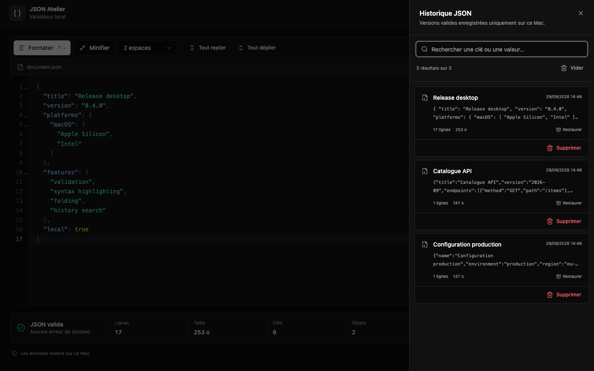

# JSON Atelier

JSON Atelier est un éditeur JSON local pour macOS. Il valide, formate, minifie et explore les documents sans les envoyer sur un serveur.



## Télécharger l'application

Tu peux télécharger la version macOS depuis l'onglet [Releases](https://github.com/Akhu/Json-Atelier-Lint/releases) de GitHub.

- Dernière version directe (.dmg) : https://github.com/Akhu/Json-Atelier-Lint/releases/latest/download/JSON-Atelier-universal.dmg
- Ouvre le `.dmg`, puis glisse l'app `JSON Atelier.app` dans `Applications`

## Ce que l'application sait faire

- Validation JSON avec erreur, ligne et colonne.
- Coloration syntaxique et repli des objets ou tableaux.
- Formatage à 2 espaces, 4 espaces ou tabulations.
- Minification, copie et téléchargement du document.
- Recherche dans le JSON affiché avec `⌘F`.
- Historique automatique des JSON valides avec recherche globale via `⌘⇧F`.
- Déduplication des documents sémantiquement identiques.

Les documents et l'historique restent sur le Mac. L'application stocke le document courant dans `localStorage` et l'historique dans IndexedDB.

## Installation pour développer

Prérequis : macOS, Node.js 24 et npm. Depuis le clone du dépôt :

```bash
npm ci
npm run electron:dev
```

Le mode web seul reste disponible avec `npm run dev`.

## Commandes utiles

```bash
npm test                 # tests unitaires
npm run build            # vérification TypeScript et build Vite
npm run check            # tests puis build
npm run icon             # régénère l'icône macOS depuis le SVG
npm run electron:pack    # produit une .app universelle locale
npm run electron:dist    # produit un DMG universel
```

Les artefacts macOS arrivent dans `release/`. Le build universel contient les architectures Intel `x86_64` et Apple Silicon `arm64`.

## Signature et notarisation Apple

La distribution publique demande un certificat `Developer ID Application` et un profil `notarytool` enregistré dans le Trousseau. Aucun identifiant Apple n'est stocké dans ce dépôt.

```bash
export CSC_NAME="Votre nom (TEAMID)"
export NOTARY_PROFILE="json-atelier-notary"
npm run electron:release
```

La commande construit le DMG, le signe, l'envoie à Apple, agrafe le ticket de notarisation et lance la vérification Gatekeeper.

## Publier une version

Les versions sont construites, signées et notarisées en local, puis déposées dans l'onglet Releases. Une seule fois, enregistre un profil de notarisation dans le Trousseau (Apple ID, Team ID et mot de passe d'application) :

```bash
xcrun notarytool store-credentials json-atelier-notary
```

Pour chaque version, mets `version` à jour dans `package.json` et `CHANGELOG.md`, puis :

```bash
export CSC_NAME="Votre nom (TEAMID)"
export NOTARY_PROFILE="json-atelier-notary"
npm run electron:release
gh release create v0.5.0 release/JSON-Atelier-universal.dmg --title "v0.5.0" --generate-notes
```

Le DMG garde le même nom à chaque version. Le lien `https://github.com/Akhu/Json-Atelier-Lint/releases/latest/download/JSON-Atelier-universal.dmg` pointe donc toujours vers la dernière release.

## Stack

- Electron et electron-builder
- React, TypeScript et Vite
- CodeMirror 6
- Tailwind CSS et composants Radix UI
- Vitest

## Contribuer

Les correctifs ciblés et les améliorations d'ergonomie sont bienvenus. Lis [CONTRIBUTING.md](CONTRIBUTING.md) avant d'ouvrir une pull request. Pour une vulnérabilité, suis [SECURITY.md](SECURITY.md) et évite les issues publiques.

Les changements publiés sont listés dans [CHANGELOG.md](CHANGELOG.md).

## Licence

JSON Atelier est distribué sous licence [MIT](LICENSE).
